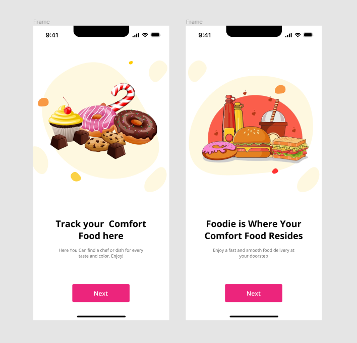
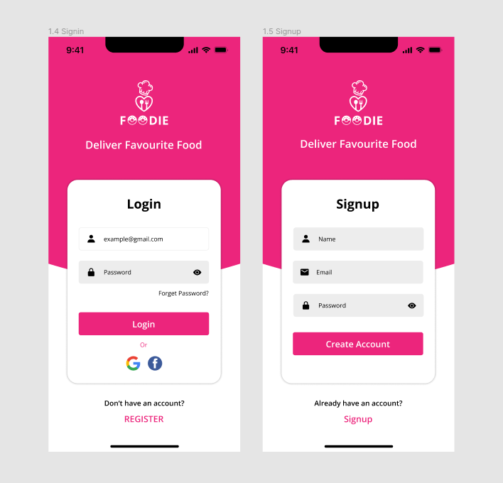
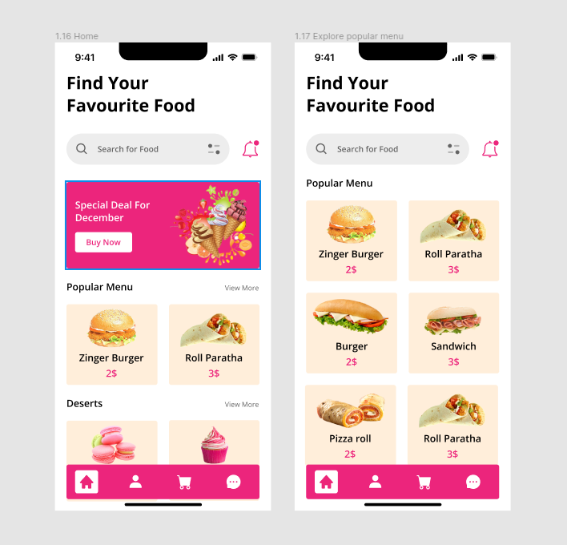

# Food App

- A concept mobile app UI/UX prototype based on Qt Quick technology.

## Description

Food App is a mobile application prototype for practicing UI/UX programming with QML. It provides a simple, intuitive interface for exploring, selecting, and ordering food as a training exercise.

## Demo
Here are some screenshots showcasing the current state of the app:

## Note
This sample is not yet complete and is under development. Stay tuned for updates and new features.
